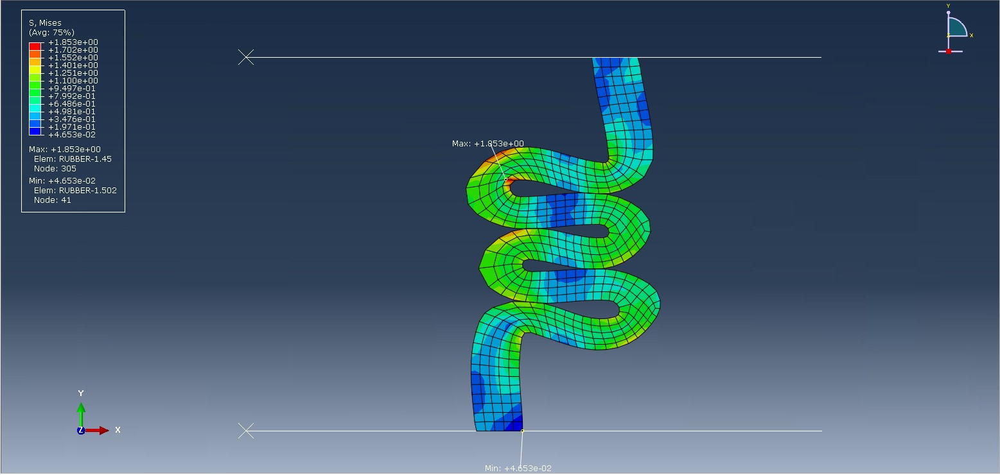
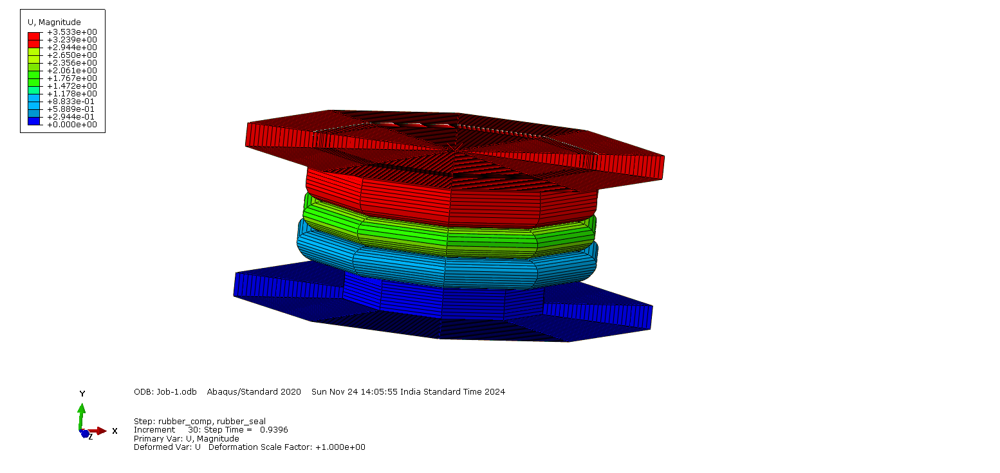
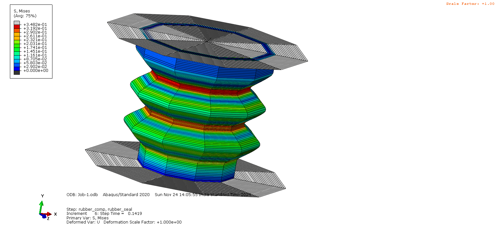

# 🧪 Rubber Compression Simulation using Abaqus

This project presents a finite element analysis of a rubber bush under compression using Abaqus CAE. The objective was to understand the stress distribution, deformation pattern, and failure zones of rubber components using hyperelastic material models like Mooney-Rivlin and Ogden.

---

## 🔧 Tools & Techniques
- 🛠 **Abaqus CAE 2020**
- 🔄 Hyperelastic modeling: Mooney-Rivlin & Ogden
- 🔬 Von Mises stress evaluation
- 📦 Element type: C3D8H
- 📐 Simulation-based design analysis

---

## 🎯 Objective
To simulate rubber compression behavior and analyze its deformation, stress zones, and failure characteristics for use in automotive, aerospace, and industrial applications.

---

## 📁 Project Files

| Type | Description | File |
|------|-------------|------|
| 📄 Report | Full simulation methodology & analysis | [`SWAPNILJOSHI_REPORT.pdf`](SWAPNILJOSHI_REPORT (1).pdf) |
| 🎞️ Video | Abaqus simulation animation | [`rubber_Comp.avi`](rubber_Comp.avi) |
| 🖼️ Image | Max & Min stress |  |
| 🖼️ Image | Displacement visualization |  |
| 🖼️ Image | Von Mises stress result |  |

---

## 📈 Key Results
- ✅ Large elastic deformation under compressive load
- ✅ Von Mises stress distribution helps identify failure-prone areas
- ✅ Load-displacement graph showed nonlinear behavior, confirming hyperelastic response

---

## 📌 Applications
- 🚗 Automotive: engine mounts, bushings, tires
- ✈️ Aerospace: vibration isolators, seals
- 🧰 Industrial: hydraulic seals, dampers

---

## 👤 Author
**Swapnil Joshi**  
M.Tech – Product Design & Manufacturing  
VTU, Belagavi  
📧 joshiswa456@gmail.com

---

> Simulated with precision. Designed for durability.
